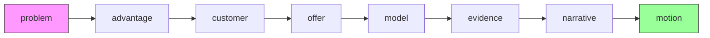
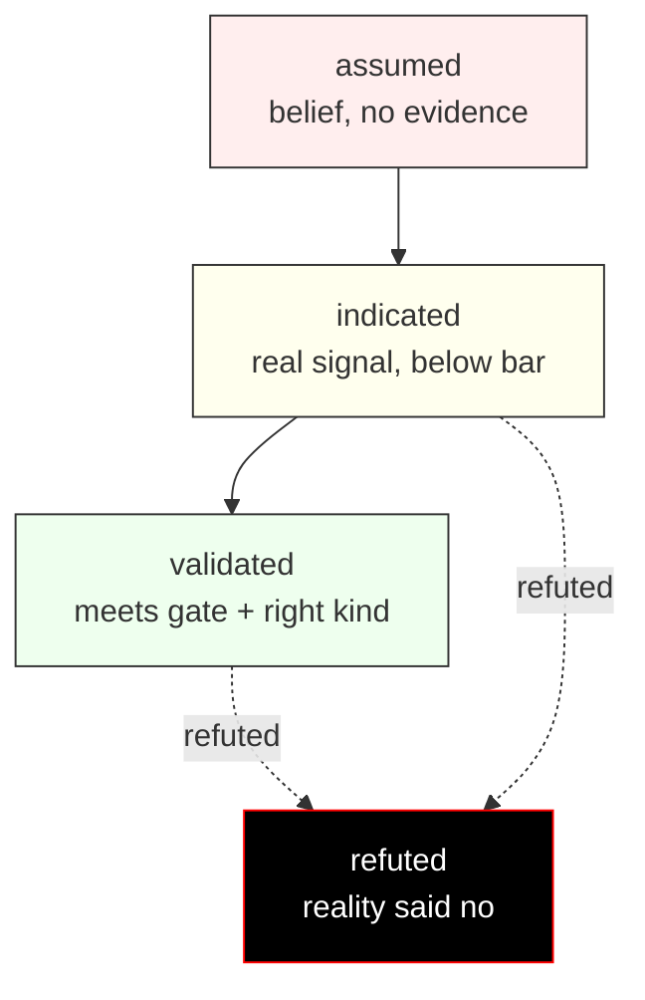

# flawline

[](https://www.npmjs.com/package/flawline)
[](https://github.com/bilhokista/flawline/actions)
[](LICENSE)

**Your strategy document cannot tell you which parts of it are guesses. This one can.**

A founder's thesis is a stack of claims. The problem is real, the segment is
reachable, they will switch, they will pay, this channel works. Each claim rests
on the ones below it, and in a normal strategy document — a deck, a Notion page,
a canvas — all of them are formatted identically. The claim backed by nine
interviews looks exactly like the one someone thought of in the shower.

So the stack gets built anyway, and the failure shows up months later as "we
built the wrong thing", when what actually happened is that a confident sentence
on slide fourteen was resting on an assumption nobody had written down.

flawline puts the strategy in git as markdown, makes every claim declare what
holds it up, and then refuses to let a claim be stronger than its own
foundations.

```console
$ npx flawline check
strategy/motion.md: error: [overreach] channel-works
    Claims "validated" while resting on "problem-exists", which is only
    "assumed". A claim cannot be stronger than what holds it up.
strategy/problem.md: error: [gate-not-met] problem-exists
    Critical problem claim is "assumed" but the gate requires "indicated", and
    work has already moved on to motion. Close this before going further.

2 error(s), 0 warning(s).
$ echo $?
1
```

The shape that produces: campaign data for 200 prospects and a conversion rate
worth celebrating, sitting on top of a problem statement nobody had ever checked
with a customer. Both facts in the same repository, and nothing connecting them.
The numbers are not the weak link — the sentence underneath them is.

## Install

```bash
npx flawline init
```

One document appears in `strategy/`, for the stage you are actually in,
pre-loaded with the claims it owns — all marked `assumed`, because on day one
that is what they are.

The other seven stay shut. Eight blank documents invite you to fill in eight,
and a form filled in alone passes the checker while establishing nothing. Each
one opens when the stage before it holds, and `flawline init` is how you collect
them.

```
strategy/
  problem.md     what goes badly, for whom, and what it costs
  advantage.md   what is authentically yours and expensive to fake
  customer.md    who they are, what they want done, who can say yes
  offer.md       what you sell, and whether the gain clears switching cost
  model.md       price, unit economics, channel, moat or honest absence
  evidence.md    what to test, in what order, with thresholds set in advance
  narrative.md   vision, mission, positioning, the story
  motion.md      go to market, selling, hiring the bottleneck
```



Edit the statements to say what you actually believe. Commit them. Then:

```bash
npx flawline status   # what is settled, what is still a guess
npx flawline check    # exits 1 when a claim outruns its evidence
npx flawline report   # where this stands, and the one thing to do next
```

`report` names the riskiest claim resting on nothing, says how much is riding on
it, and gives exactly one recommendation. It also names what it refuses to
advise on and why — a summary that recommends a channel on top of eight
assumptions is the slide this project exists to prevent, so a recommendation is
held to the same rule as a claim.

`report --json` and `check --json` emit the same content for another agent to
act on. One task does not delegate: an agent cannot sit down with a stranger,
and until someone does, nothing leaves `assumed`.

## In CI

`check` exits 1 on a claim that outruns its evidence, so a pull request that
quietly promotes a guess to a fact fails like any other broken build.

```yaml
name: strategy

on:
  pull_request:
    paths: ['strategy/**']

jobs:
  flawline:
    runs-on: ubuntu-latest
    steps:
      - uses: actions/checkout@v4
      - uses: bilhokista/flawline@v0
```

Findings arrive as annotations on the offending lines, in the diff, where the
person upgrading the claim has to answer for it. Gate the pull request that
edits `strategy/`, not the deploy — [docs/ci.md](docs/ci.md) has the inputs, the
exit codes, and what not to block.

## How a claim works

```yaml
---
stage: customer
gate:
  requires: indicated
  min_observations: 5
claims:
  - id: what-gets-in-the-way
    statement: >-
      Ops leads re-key invoice data between two systems every Monday because
      the finance export drops the cost centre.
    confidence: indicated
    critical: true
    depends_on: [problem-exists]
    evidence:
      - method: interview
        source: research/interviews/2026-09-12-acme.md
        n: 9
        collected_at: 2026-09-12
---
```

Nine interviews, and the claim is `indicated` rather than `validated`. That is
not modesty — it is the ceiling the checker enforces on interview evidence, for
reasons in the next section.

Four fields do the work:

| Field | What it buys you |
| --- | --- |
| `confidence` | `assumed`, `indicated`, `validated` or `refuted`. The default is `assumed`, and admitting that costs nothing. |
| `evidence` | Where a stranger could go and check. No entry, no confidence above `assumed`. |
| `depends_on` | What this claim rests on. The checker walks it. |
| `critical` | The thesis does not survive without this one. Gates block on it. |



## What `check` actually enforces

| Finding | Meaning |
| --- | --- |
| `unsupported-confidence` | Marked `indicated` or better with no evidence cited. |
| `insufficient-observations` | Marked `validated` below the stage's bar. |
| `method-ceiling` | The *kind* of evidence cannot carry that confidence, at any volume. |
| `stale-evidence` | `validated` on evidence past the stage's shelf life. |
| `undated-evidence` | `validated` in an expiring stage with no `collected_at`. Warning. |
| `overreach` | Stronger than the claim holding it up. |
| `rests-on-refuted` | Built on something reality has already killed. |
| `gate-not-met` | A critical claim behind you is unsettled while you claim evidence ahead of it. |
| `unknown-dependency` | Depends on a claim that does not exist. |
| `dependency-cycle` | Two claims justifying each other. |
| `duplicate-claim-id` | The same id declared twice. |
| `incident-beyond-occurrence` | An incident record used for what the incident cost, or what people already do about it. |
| `stage-opened-early` | A stage document written before the stage behind it holds. |
| `no-refutation-recorded` | A document with a critical claim that never says what would refute it. |
| `method-beyond-reach` | A method used for a claim its artefact cannot answer. |

### The kind of signal caps the confidence

Volume does not change what a signal *is*. A hundred thousand saved posts is a
hundred thousand observations of costless attention and zero observations of
anyone paying.

| Signal | Ceiling |
| --- | --- |
| Engagement — likes, saves, views, follows | `assumed` |
| Warm replies in DMs, stated intent | `assumed` |
| Interviews and surveys | `indicated` |
| Self-report about your own history | `indicated` |
| The record of one incident, published by whoever it went wrong for | `indicated` |
| A review by someone the platform confirms paid | `indicated` |
| Code someone else shipped to prevent this failure | `indicated` |
| Outreach an agent sent without saying so | `assumed` |
| Waitlists, landing pages, demos that went well | `indicated` |
| Quote and proposal requests | `indicated` |
| Deposits, payments, repeat payments | `validated` |
| Someone approaching unprompted | `validated` |

The interview line is the one people argue with, so: interviews establish that
a problem exists and what it costs, which is the most valuable research
available early. They cannot establish that anyone will pay, because nothing
was at stake when the answer was given. Four hundred interviews still stop at
`indicated`.

`field-observation` sits with interviews at `indicated`: you worked inside it
and watched it happen, so nobody was performing for you and nobody was being
polite. That beats asking. It is still one witness with no artefact a stranger
could open, so it stops where interviews stop. Watching from outside without
that access is not this.

People who already know you sit at `assumed` too — `colleague` and `friend`
answer about the relationship, and the offer cannot be separated out
afterwards. So does reading about a market rather than sampling it: `scraping`
and `desk-research` cap at `assumed`, because nobody in a scraped post was
asked your question or had anything at stake when they wrote it.

`incident-record` is the one exception to that, and it is a narrow one. A
post-mortem naming the three payments that failed, the error code and the date,
published by the company that failed to pay, is not research about a market. It
is the event itself, written down by someone with something to lose, at a URL
anyone can open. Two limits keep it from becoming the comfortable evidence the
other desk methods are: it counts on the problem stage only, and it can never
raise `problem-is-expensive` or `they-already-try`. A record says a thing
happened. What it cost, and what the person did next, are answers only that
person has.

A method not on the list counts as an assumption. The tool cannot read what a
name means, and a name it cannot read is not a reason to believe anything.
Stronger evidence recorded beside it still lifts the claim, so one real payment
carries a claim that also cites a scrape.

Within the list, the tool is a mirror rather than an adversary — if you rename
`engagement` to `payment` it will believe you, and you will know you did it.

### Settled facts about the outside world expire

The `model` and `motion` stages ship with `evidence_half_life_days: 120`. A
`validated` claim there goes stale after four months.

Channels stop working without telling anyone. A marketplace changes its
ranking, an algorithm stops surfacing an account, the pool of people willing to
refer you runs dry. Revenue tapers, and by the time the trend is unmistakable
there are months of plans resting on a number that died quietly.

Re-measure a stale claim. Do not re-date it — re-dating without re-measuring is
the easiest way to make this tool lie to you, in the direction you were already
hoping for.

### Two more decisions worth knowing about

**Planning ahead is free.** Sketching all eight stages as assumptions passes
cleanly. Only claiming that reality has *confirmed* something moves the frontier
and starts gating what sits behind it. You are never punished for thinking
ahead, only for asserting ahead.

**Refuting a claim is supposed to break things.** When a test fails and you set
a claim to `refuted`, every claim above it starts erroring. That cascade is the
product. It is the list of things you believed for reasons that just stopped
being true, and no other tool in a founder's stack will hand it to you.

## The advantage stage, and the name

The second stage is the one this project is named after, and it inverts the
usual advice.

Most moat guidance points at things a solo founder cannot build: network
effects, accumulated data, a distribution position. `advantage.md` starts
somewhere available to everyone — at constraints and defects rather than
strengths — on a simple argument:

**Strengths are mostly purchased, and anything purchasable can be purchased by
someone with more money than you. What is authentically yours cannot be bought
at all.**

Three claims carry it:

- `what-is-authentically-mine` — a trait, constraint or history you would have
  anyway. Not a skill acquired because it was useful.
- `context-values-it` — the arena where that trait is an asset rather than a
  liability. A trait has no fixed value; the work is choosing the setting.
- `expensive-to-fake` — what it would cost a competitor to fake it credibly.
  A weekend means you have a preference. Years they did not live means you have
  something that compounds.

`moat-or-honest-absence` in the model stage depends on `expensive-to-fake`, so
a moat claim cannot outrun the forgery test underneath it.

The intellectual debts are specific. Eric Barker's *Barking Up the Wrong Tree*
supplies the mechanism — intensifiers, traits penalised in one environment and
rewarded in another. Dave Trott's *One Plus One Equals Three* supplies the
combination method. Peter Thiel's *Zero to One* supplies the goal and, by the
account of the founder this was built with, not much procedure — which is why
the stage is a set of questions rather than an invitation to find a secret.

The criterion that ties them together is not from any of the three: **a flaw is
authentic to one person, so it cannot be copied, and that is what makes it a
moat rather than a quirk.** That one is the author's, and it is why the project
is called flawline.

## Working with an AI agent

`skills/` holds one skill per stage, written for Claude Code, Cursor and any
agent that reads instruction files. They run the interviews, write the claims,
and — the part that matters — refuse to inflate a confidence because you sound
certain.

In Claude Code they install as a plugin:

```
/plugin marketplace add bilhokista/flawline
/plugin install flawline@flawline
```

Anywhere else, copy the directories in:

```bash
cp -r skills/flawline-* ~/.claude/skills/
```

Each skill is a standalone `SKILL.md`. Shared rules live in
[skills/DISCIPLINE.md](skills/DISCIPLINE.md), including the one that does the
most work:

> Never raise a confidence because the founder sounds certain. Certainty is not
> evidence. Conversations with friends, co-founders, investors and advisors are
> not customer evidence.

An agent with no instructions is an enthusiasm machine. It will help you write
a beautiful strategy document containing nothing you have checked. These skills
exist to make it argue with you instead.

## Where this stops

flawline ends at `sale-is-repeatable`: you know what to build, for whom, and
that a stranger has paid for it. Build-side methods take over from there —
requirements, architecture, delivery. There are good tools for that stage and
this is not one of them.

The gap this fills is the one before it. Plenty of tooling helps you build the
thing well. Almost none helps you find out whether the thing should exist, and
then hold you to what you found.

## Why markdown in git

Because strategy drifts from reality silently, and git is the only place that
makes drift visible.

- `git log strategy/problem.md` shows when you stopped believing something, and
  what you knew at the time.
- `flawline check` runs in CI, so a pull request that quietly upgrades a guess
  to a fact fails like any other broken build.
- It lives beside the code, so the people implementing a decision can read the
  evidence for it without asking anyone for access.

A canvas in a design tool cannot do any of that. It also cannot be wrong in a
way anyone notices.

## Where the rules came from

The dependency and gate logic is a design. The method ceilings, the four-month
shelf life, the owned-versus-borrowed distinction and the advantage stage are
not — they come from a structured debrief with the author about small businesses
that failed in specific ways. Each rule exists because something specific went
wrong.

- **Borrowed channels died at three to six months**, twice: marketplace
  placement and word-of-mouth referral. Neither announced it. That is where
  `evidence_half_life_days: 120` comes from, and why the distinction between
  owned and borrowed reach is a claim the `model` stage insists on.
- **The evidence that misled hardest was engagement, DM enthusiasm, and
  proposal requests that evaporated.** Hence the ceilings, and hence engagement
  buying nothing at all.
- **Interviews were nominated as the evidence most in need of a hard cap** —
  including interviews done properly — on the grounds that until money moves it
  is still just talk. That is a stricter rule than the first draft of this tool
  had, and it invalidated part of its own test suite when it landed.
- **The failure point was channel and unit economics, not the problem stage.**
  The strictest gates sit there as a result, rather than at the front.

One debrief is one debrief — n=1 by the standard this tool applies to everyone
else, and recorded as such rather than dressed up as research. If your own years
went differently, that is worth an issue.

## Prior art and licensing

This project stands on the Business Model Canvas, the Lean Canvas, and the jobs
to be done literature. Those debts, the licence each work carries, and what this
project deliberately does **not** reproduce are all set out in
[canvases/ATTRIBUTION.md](canvases/ATTRIBUTION.md).

The short version:

- **Code** (`packages/`) — MIT.
- **`canvases/`** — CC BY-SA 3.0, because it adapts work released under
  ShareAlike and those terms travel with it.

The split is real, not decorative: it means you can vendor the code without
inheriting a copyleft obligation, and it means the original authors' chosen
licence is honoured rather than quietly dropped.

## Contributing

`CONTRIBUTING.md` has the detail. Two things matter more than the rest:

1. **A new check needs a failing test first.** The whole value of this tool is
   that its findings are trustworthy. A false positive teaches founders to
   ignore the output, which is worse than having no tool.
2. **Methodology changes need a reason, not a preference.** Say what goes wrong
   for a real founder today, and what the change would have caught.

 177 tests, 98% coverage. `npm test` at the repository root.
